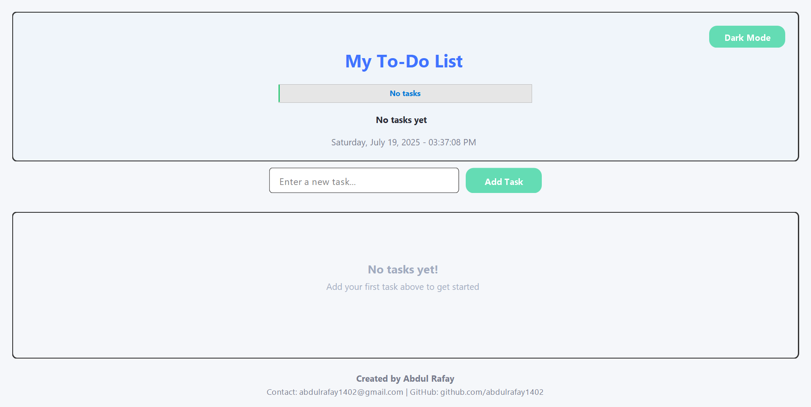
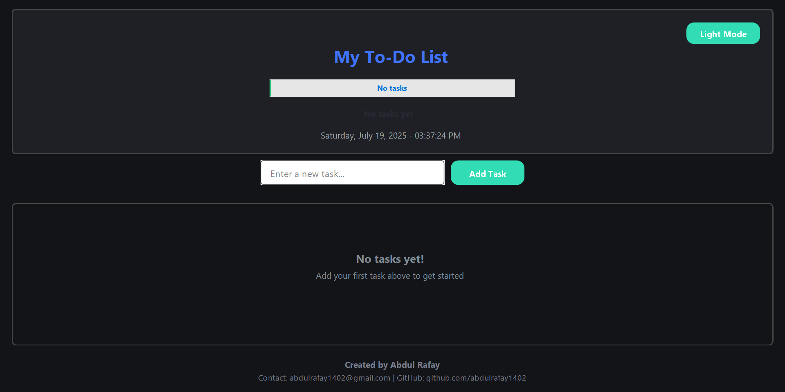

# 📝 Modern Java Swing To-Do List

A beautifully designed and functional To-Do List application built using **pure Java Swing**, featuring:

- 🌗 Light/Dark Mode toggle  
- 📅 Real-time date and time  
- 📊 Progress tracking with a custom progress bar  
- ✅ Task completion tracking  
- ✏️ Edit/Delete tasks  
- 💾 Persistent task saving using serialization  
- ✨ Stylish UI with custom-styled buttons, borders, and components  

---

## 🎥 Preview

## 🌓 Light and Dark Mode Previews

### 🌞 Light Mode


### 🌙 Dark Mode



---

## 🚀 Features

- **Modern UI** – Custom buttons, rounded borders, hover effects
- **Light & Dark Mode** – Toggle with seamless theme switching
- **Progress Visualization** – Live completion status and percentage
- **Urgent/Important Detection** – Auto-coloring based on keywords
- **Smart Input Field** – Placeholder behavior and validation
- **Persistent Tasks** – Stored locally via serialization (`tasks.dat`)

---

## 🛠️ Tech Stack

- **Java 8+** – Programming Language  
- **Swing** – UI Framework  
- **Object Streams** – For saving/loading tasks locally  

---

## 📦 How to Run

1. **Clone this repository**
   ```bash
   git clone https://github.com/abdulrafay1402/ToDoList
   cd ToDoList
2. **Compile and run the application**
   ```bash
   javac ToDoListPureSwing.java
   java ToDoListPureSwing

   
---

## 📃 License

This project is for academic and institutional use. Please credit the developers if reused or modified for deployment.

---

## 🙋‍♂️ Author

**Abdul Rafay**  
📧 Email: abdulrafay1402@gmail.com  
🐙 GitHub: [@abdulrafay1402](https://github.com/abdulrafay1402)

---

## ⭐ Support

If you like this project, consider giving it a ⭐ on GitHub.  
Feedback, contributions, and forks are always welcome!

